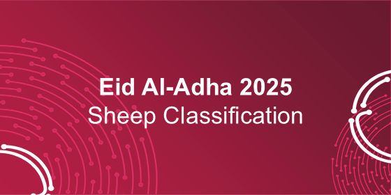

# DAL-sheep-classification-challenge-2025


This notebook demonstrates a complete workflow for classifying 7 Arabian sheep breeds (Naeimi, Najdi, Harri, Goat, Sawakni, Roman, Barbari) as part of the Eid Al-Adha 2025: Sheep Classification Challenge.

## Dataset
The dataset contains images of the 7 sheep breeds. It is split into **training, validation, and test sets**, with class balancing handled via class weights.  
> **Note:** You can download the dataset from the official [Eid Al-Adha 2025 Challenge page](https://www.kaggle.com/competitions/sheep-classification-challenge-2025). Update the file paths in the notebook after downloading.

## Features
- **Data Augmentation:** Uses `ImageDataGenerator` with MobileNetV2 preprocessing, including shear and zoom transformations.
- **Model:** Transfer learning using **MobileNetV2** (pretrained on ImageNet), with global average pooling, batch normalization, dropout, and a dense layer for 7-class classification.
- **Training:** EarlyStopping and ReduceLROnPlateau callbacks, class weighting to handle imbalanced classes, and up to 50 epochs.
- **Evaluation:** Accuracy, loss, classification report, and confusion matrix on train, validation, and test sets.

## How to Run
1. Clone the repository:
```bash
git clone https://github.com/WejdanMjd/DAL-sheep-classification-challenge-2025.git
```

2. Install dependencies:
```bash
pip install -r requirements.txt
```

- **Download the dataset** and update file paths in the notebook.
- **Open the notebook** in Jupyter or Google Colab and run all cells.

## Results
- **Test Accuracy:** ~36%
- The confusion matrix shows which breeds are most commonly misclassified.
- Some breeds like Najdi have high recall, while Roman and Barbari are harder to classify due to fewer samples.

## License
This notebook and project are released under the **MIT License** – see the LICENSE file for details.
